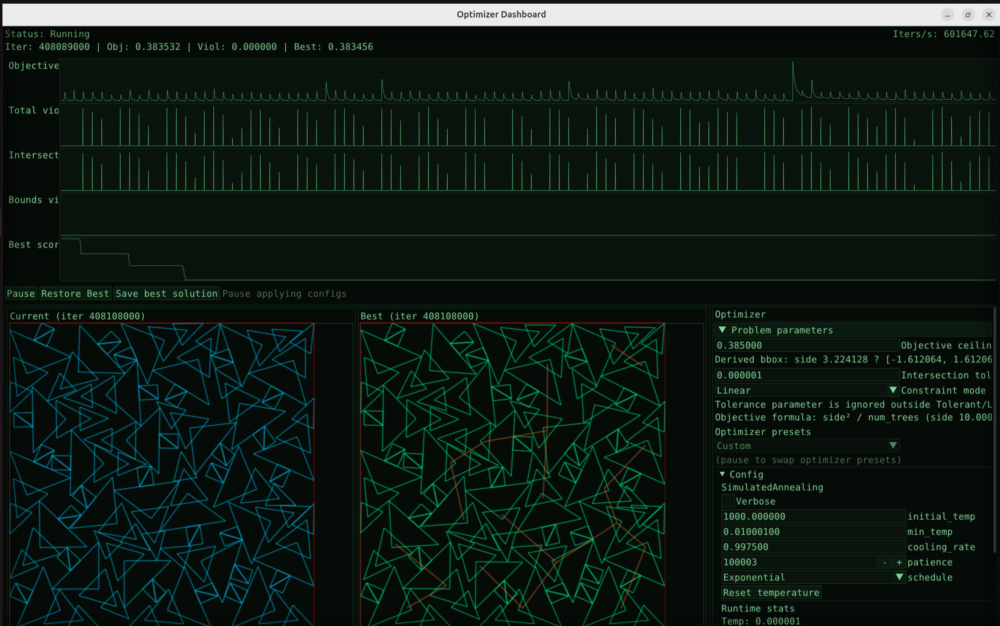

# Santa 2025 - Christmas Tree Packing Challenge

A solution framework for the [Kaggle Santa 2025](https://www.kaggle.com/competitions/santa-2025) tree packing optimization challenge.

## The Problem

Pack N Christmas tr ees (polygonal shapes with 5 triangular faces) into a 2D square space. Each tree can be translated and rotated. Trees cannot overlap (touching at edges/vertices is allowed). The goal is to minimize the bounding square side length.

**Objective:** Minimize

$`\frac{\text{side\_length}^2}{\text{num\_trees}}`$

## Dashboard



Real-time visualization of the optimization process with:
- Live metrics tracking (objective, violations, best score)
- Current vs best solution comparison
- Configurable optimizer parameters

## Project Structure

```
santa2025/
├── santa/                      # Main package
└── cpp/                        # C++ performance-critical code
```

## Key Techniques

### Collision Detection
- **Separating Axis Theorem (SAT)** for triangle-triangle intersection
- Vectorized across all triangle pairs using JAX

### Spatial Acceleration
- **2D Grid Hashing** for efficient neighbor lookup
- Pre-filters collision candidates before expensive SAT checks

### Optimization
- **Simulated Annealing** with configurable cooling schedules
- **ALNS (Adaptive Large Neighborhood Search)** combining ruin and recreate operators
- **Incremental evaluation** - only recomputes affected constraints

### Operator Composition
Flexible DSL for building optimization pipelines:
```python
optimizer = (SpatialRuin(n=5) & BestRecreate()) * 50 | NoiseOptimizer()
optimizer = SimulatedAnnealing(optimizer, initial_temp=1000, cooling_rate=0.9997)
```

## License

MIT
